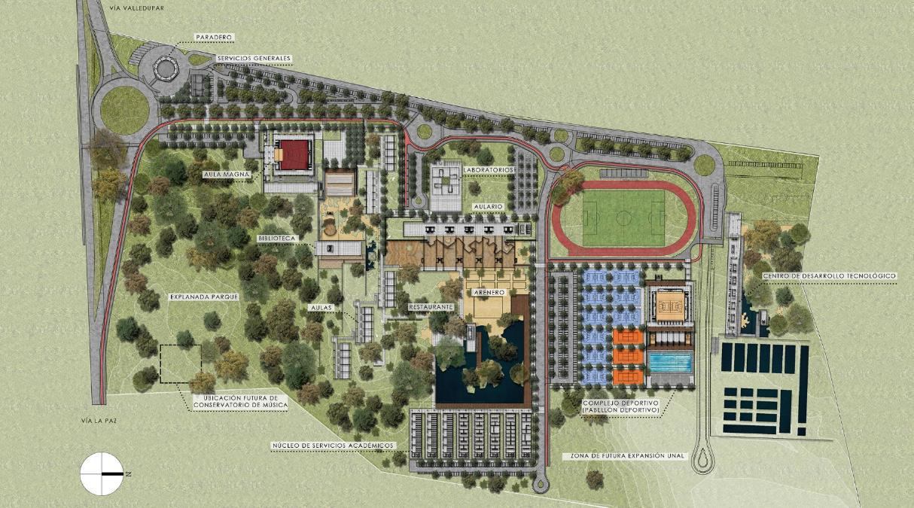
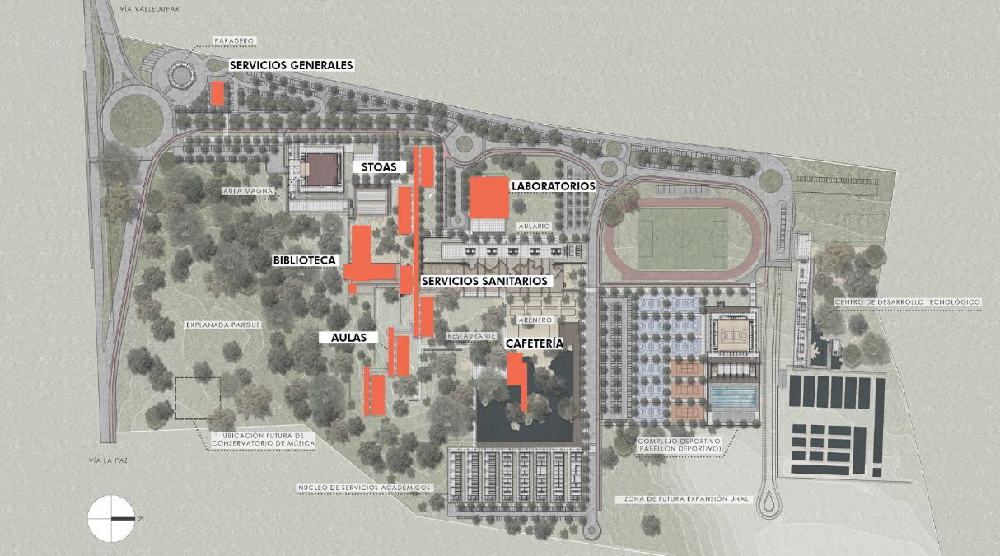

# **Infraestructura**

La sede de la Paz, es un proyecto integral que incluye diferentes estapas, con multiples edificaciones, que constituyen un campus integro y adecuado para las necesidades de la comunidad universitaria del departamento de Cesar.

A la fecha el campus esta en proceso de construccion, pero se estima que el campus una vez cumpleto se distribuya y luzca como la siguiente imagen.

Un aspecto clave de este proceso es la contruccion e implementacion de una red de laboratorios que aportaran el desarrollo de los objetivos misionales de la sede ()Academia, Investigacion y Extension). Esta red de laboratorios busca implementar un metodo de innovacion pedagogica donde la experimentacion uso de la tecnoogica y sobre todo un ambinete de colboracion entre poryectos curricualres sea el fundamento de las activiades a realizar. Auque los laboratorios podran aportar en el programa curricular de cada proyecto, no se han concevido como un espacio para dictar clases, si no para reforzar los conceptos dirigidos por los docentes.

La siguiente imagen ilustra el actual estado de la sede donde se encuntra la biblioteca, aulas de clase, y los edificios que conforman la sede en este momento. Para el laboratorio de Ciencias de la Informacion Geograrfica o GIScience., se ha destinado el bloque no 11, donde se espera adecuar un espacio suficiente para equipos de procesamiento, recursos de impresion, y una sala de colaboracion, que permita reforzar las actividades que dirigan los docentes del programa de Geografia.

## Fase No 1

El proyecto de innovacion pedagogica que se describe y se implementa con el proyecto BPUN 544, y que da sustento administraivo y financiero al proyecto de laboratorios. Se debera estructurar en dos fases, una inicial que permita continuar con las clases debido a la actual situación, el trabajo de los laboratorios se ha dividido en dos fases.

La primera fase se establece con el objetivo de contar con los equipos y recursos necesacios para poder apoyar las materias del programa academico correspondiente, y que ya estan en curso, para asi dar tiempo suficiente para la ejecucion de la construccion de los nuevos edificios de la segunda fase.

Esta fase inicial ademas permite ajustarse a las restricciones de aforo que se deben seguir debido a la actual sitacion de pandemia.

## Fase No 2

La segunda fase esta estructurada para fortalecer la red de laboratorios y otros espacios que son requeridos en la sede de la Paz. El laboratorio de GIScience contará con un bloque completo donde tendrá más del doble de espacio del asignado para la fase inicial. La siguiente figura muestra un *render* de como luciria la red ed laboratorios una vez de finalice.

Al siguente imagen muestra el plano entregado por el area de infraestructura donde se dispone el espacio que se distruira en el area asignada para el laboratorio de GIScience. Este espacio sera compartido con otros dos laboratorios de la red. El laboratorio de Paz Terrotorial y el Laboratorio de Analisis y VIsualizacion de datos.

Con este nuevo y mas amplio espacio, el laoratorio de GIScience contara con un area para impresion, almcenamiento y carga de elementos, adeas de un area dedicada para servidores o eqipos de procesamiento de mayor capacidad que se usen en el laboratorio para proyectos especificos.

Tiene un area de espacio o trbajo claborativo, con mesas libres que permitan el trabajo de hasta 4 estudiantes, esta area permitira a los estudiantes usar sus propios equipos o usar los portatles disponibles en el laboratorio, ademas de usar los demas equipos con los que se dotara este espacio.

Se busca que los estudiantes encuentren en esta area un espacio conjnto para compartir ideas con otros estudiantes, trabajar en asignaciones de sus materias, crear proyectos con estudiantes de otros programas, ser el punto de encuentro y de trabajo de semilleros o grupos de investigacion.

Se ha pripuesto un espacio modular, lo cual implica que este espacio podra dividirse en dos si se requiere para una eventual conferencia o seminario y aun asi contra con otro espacio para el trabajo de otros estudiantes.

El area colaborativa ademas contara con tomas electricas que caeran del techo para evitar problmas y riesgos con tomas a piso, espacios para descanso, y una pantalla de 70 pulgadas que se podra usar para proyectar tanto una conferencia o realizar una presentacion especifica.

El laboratorio de Ciencias de la informacion Geografica, no es un aula de clase pero contara con los elemenos necesarios para permitir a un docente realizar activiades en este espacio y permitir que otros estudiantes se unan a las actividades. Al estar estructurado como bloques conectados los estudiantes de multiples proyectos pueden visitar los laboratorios y observar e interacturas con otros programas academicos.

Se ha incluido ademas una zona de visualizacion que contara con un ScreenWall, de amplio formato para presentaciones dinamicas donde se requiera un formato grande de presentacion. Esta zona incluira una fila de pequenos cubiculos disenaods para el trabjo de personal de investigacion que requiere cierta tranquilidad en su trabajo diario.

Aunque el laboratorio de GIScience se ha definido como un espacio abierto sin oficinas personales, este espacio esta pensado para que futuro personal de investigacion o extension pueda trabajar de forma constante durante la duracion de su proyecto.

Esta fase aun esta proceso y sera una etapa que puede tomar hasta dos años para su culminacion, sin embargo el proceso de diseño de este laboratorio permitira que los elementos solicitados en la fase No 1 se puedan adecuar en el futuro espacio de la fase No 2. Donde eventualmente se requiera solicitar elementos adiconales de mobiliario y mas dispositivos para suplir la futura demanda.

Con el animo de ser conservadores con el gasto y tambien dar espacio a que los docentes que lideraran las materias puedan desarrollar sus interes y lienas de investigacion los equipos y recursos adquiridos se ajustan a las necesidades actuales de  procesamiento de datos, pero tambien da margen para nuevas ideas y recursos que los docentes puedan requerir.

Es el siguiente capitulo se describiran los equipos adquiridos para la fase No 1 y con los que se espera este laboratorio comience sus labores para el segundo semestre del 2021.
